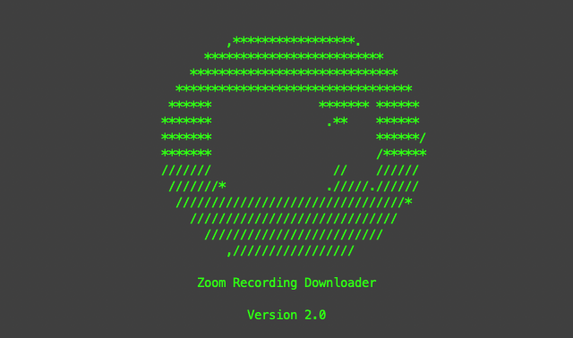

# Zoom Recording Downloader

[](https://raw.githubusercontent.com/ricardorodrigues-ca/zoom-recording-downloader/master/LICENSE)

**Zoom Recording Downloader** is a docker container that uses Zoom's API (v2) to download and organize all cloud recordings from a Zoom account onto local storage.

It downloads, at a specified time, all the recordings in the folder you desire, organized by author (email) and meeting.

This is useful for instance when managing a Zoom account with several users, that have periodic meetings and webinars, and store all the lectures in the cloud – which is going to be filled very easily.

The python code has been forked (and adapted) from [zoom-recording-downloader](https://github.com/ricardorodrigues-ca/zoom-recording-downloader) by [Ricardo Rodrigues](https://github.com/ricardorodrigues-ca).

## Screenshot ##


## Prerequisites ##

_Attention: You will need a [Zoom Developer account](https://marketplace.zoom.us/) in order to create a [Server-to-Server OAuth app](https://developers.zoom.us/docs/internal-apps) with the required credentials_

1. Create a [server-to-server OAuth app](https://marketplace.zoom.us/user/build), set up your app and collect your credentials (`Account ID`, `Client ID`, `Client Secret`). For questions on this, [reference the docs](https://developers.zoom.us/docs/internal-apps/create/) on creating a server-to-server app. Make sure you activate the app. Follow Zoom's [set up documentation](https://marketplace.zoom.us/docs/guides/build/server-to-server-oauth-app/) or [this video](https://www.youtube.com/watch?v=OkBE7CHVzho) for a more complete walk through.

2. Add the necessary scopes to your app. In your app's _Scopes_ tab, add the following scopes: `account:master`, `account:read:admin`, `account:write:admin`, `information_barriers:read:admin`, `information_barriers:read:master`, `information_barriers:write:admin`, `information_barriers:write:master`, `meeting:master`, `meeting:read:admin`, `meeting:read:admin:sip_dialing`, `meeting:write:admin`, `meeting_token:read:admin:live_streaming`, `meeting_token:read:admin:local_archiving`, `meeting_token:read:admin:local_recording`, `meeting_summary:read:admin`, `recording:master`, `recording:read:admin`, `recording:write:admin`, `user:master`, `user:read:admin`, `user:write:admin`.

## Command line

1. Set environment variables (see [Environment Variables](#Environment-Variables)).

2. Run:

```sh
python3 zoom-recording-downloader.py
```

This will download the recordings that have not been downloaded yet and delete them from the cloud. If you don't want to delete them, specify the parameter `--no-delete`.

# Docker

1. Build the image using `docker build -t zoom-recording-downloader .`

    - Don't forget to build it for the right CPU. E.g. If you run it on a Mac with M processor, and want to deploy the docker container on an amd64 platform, do `docker buildx build --platform linux/amd64 -t zoom-recording-downloader .`

2. Run it with all needed parameters:

```console
docker run -d \
    -v [HOST DOWNLOAD FOLDER]:/downloads \
    --name zoom-recording-downloader \
    -e TZ=Europe/Amsterdam \
    -e ZOOM_CLIENT_ID=$ZOOM_CLIENT_ID \
    -e ZOOM_CLIENT_SECRET=$ZOOM_CLIENT_SECRET \
    -e ZOOM_ACCOUNT_ID=$ZOOM_ACCOUNT_ID \
    -e CRON_SETTINGS="0 7 * * *" \
    zoom-recording-downloader:latest
```

Or docker-compose:

```yaml
version: "3.9"

services:

  zoom-recording-downloader:
    container_name: ZoomRecordingDownloader
    image: alborworld/zoom-recording-downloader
    environment:
      - TZ=Europe/Amsterdam
      - CRON_SETTINGS=0 7 * * *
      - ZOOM_CLIENT_ID=${ZOOM_CLIENT_ID}
      - ZOOM_CLIENT_SECRET=${ZOOM_CLIENT_SECRET}
      - ZOOM_ACCOUNT_ID=${ZOOM_ACCOUNT_ID}
    volumes:
      - /LOCAL/DOWNLOAD/DIRECTORY:/downloads:rw
      - /LOCAL/LOGS/DIRECTORY:/var/log/zoom-recording-downloader:rw
    restart: unless-stopped
```

where (see [Environment Variables](#Environment-Variables)):
- `TZ`: Time Zone.
- `CRON_SETTINGS`: cron time string specifying when to execute the download.
- `ZOOM_CLIENT_ID`, `ZOOM_CLIENT_SECRET` and `ZOOM_ACCOUNT_ID` are your Server-to-Server OAuth app credentials.

Note that a host folder where the recordings will be stored must be bind mounted to the `/downloads` folder within the container. Same for the log directory.

## Environment variables

ZoomRecordingDownloader uses the following environment variables for configuration.

| Available variables   | Default value                        | Description                                                                             |
|-----------------------|--------------------------------------|-----------------------------------------------------------------------------------------|
| `ZOOM_CLIENT_ID`      | no default                           | Zoom Client ID (to be found in the Server-to-Server OAuth app config)                   |
| `ZOOM_CLIENT_SECRET`  | no default                           | Zoom Client Secret (to be found in the Server-to-Server OAuth app config)               |
| `ZOOM_ACCOUNT_ID`     | no default                           | Zoom Account Id (to be found in the Server-to-Server OAuth app config)                  |
| `TZ`                  | Europe/Amsterdam                     | Time Zone                                                                               | 
| `CRON_SETTINGS`       | `0 5 * * *`                          | Cron time string format (see [Wikipedia](https://en.wikipedia.org/wiki/Cron)) specifying when to execute the download |
| `LOG_RETENTION_MONTHS`| 3                                    | Number of months to retain logs                                                         |
| `LOG_DIRECTORY`       | `/var/log/zoom-recording-downloader` | Directory where log files are stored                                                    |

# Synology DiskStation

This project was initially created with the intention to automatically download the Zoom recordings to a Synology DiskStation. 
The docker container can be used with any other environment, however here follows a small description of what to do in the DiskStation.

To set it up you need to use the Synology Docker app, download the image, launch it and specify (in *Advanced Settings*):
1. *Enable auto-restart*
1. Under *Volume* add the folder where you want the recordings, and bind it to the /downloads container folder
1. Under *Environment* set the environment variables specified above.
   
# 🚧 Roadmap

- [ ] Add automated versioning of docker images

... and much more.

# 📄 License

This project is licensed under the MIT License - see the [LICENSE](LICENSE) file for details.